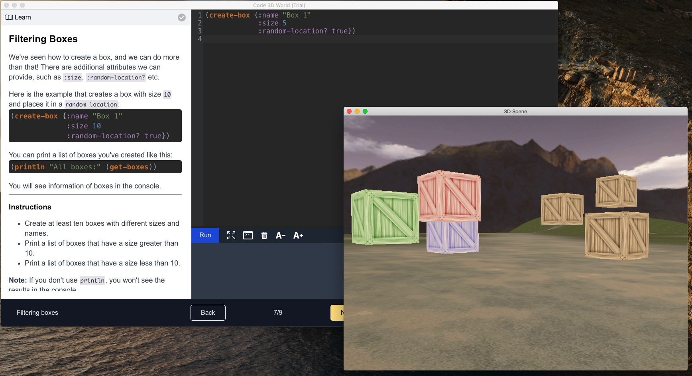

# Code 3D World
Code 3D World is interactive, and batteries included a 3D coding platform. It's designed for beginners who would like to learn to program. Clojure is the programming language used in courses.

